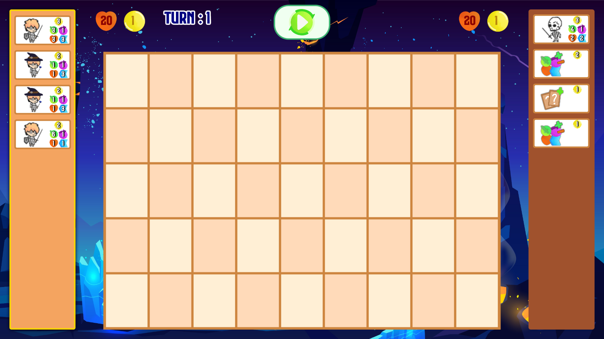
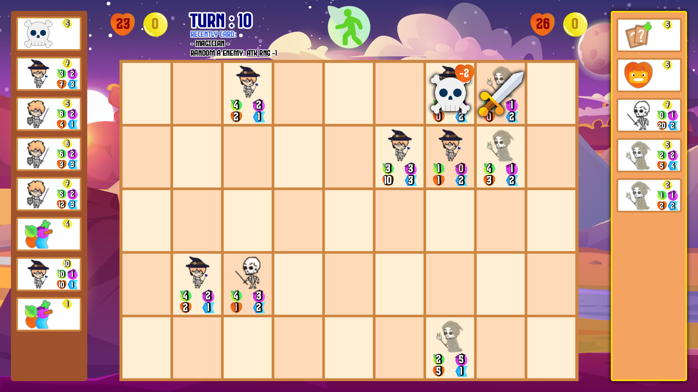
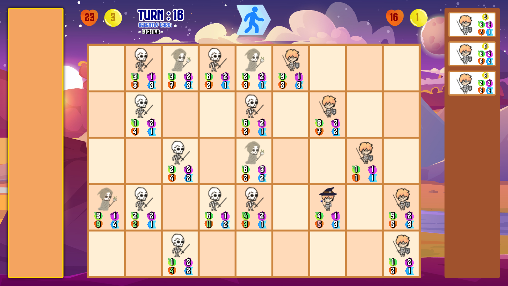

# Project-ProgMeth-2020-2
Project of 2110215 Programming Methodology course

## How to play the game
1. Download `TroopWar.jar` from https://github.com/NonRoute/Project-ProgMeth-2020-2/blob/main/TroopWar.jar
2. Download and install `Java SE 16` from https://www.oracle.com/java/technologies/javase/jdk16-archive-downloads.html
3. Download and install `javafx-sdk-16` from https://gluonhq.com/products/javafx/
4. Open command prompt, navigate to folder containing TroopWar.jar
5. Run `java -jar --module-path "C:\Program Files\Java\javafx-sdk-16\lib" --add-modules javafx.controls,javafx.graphics,javafx.media,javafx.fxml TroopWar.jar`

## Screenshots
  
  
  
  
  
  
